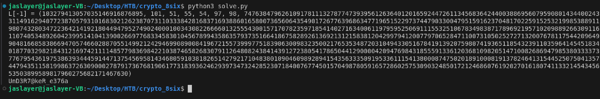

# crypto - 8six - Writeup

---  

## FLAG：
`THJCC{UnD3R7@keR_e376a}`

## Observation：
- Ciphertext  $r$  is an unknown linear combination of $(NAME,SIGN)$ modulo  $M$ , and the goal is to find  $NAME$  and  $SIGN_i$  using the  $LLL$  algorithm.  

## Construct  $LLL$  Matrix：

- For an arbitrary integer  $q$  , where  $seed[i]$  is denoted as  $s[i]$​  and  $SIGN[i]$​  is denoted as  $S[i]$​  , construct  $u \times B \equiv v \mod M$  as  
```math
\begin{pmatrix}
q, & -S_0, & -S_1, & -S_2, & -S_3, & -S_4, & -S_5, & 1
\end{pmatrix}
\begin{bmatrix} 
M & 0 & 0 & 0 & 0 & 0 & 0 & 0 \cr
s_0 & -1 & 0 & 0 & 0 & 0 & 0 & 0 \cr
s_1 & 0 & -1 & 0 & 0 & 0 & 0 & 0 \cr
s_2 & 0 & 0 & -1 & 0 & 0 & 0 & 0 \cr
s_3 & 0 & 0 & 0 & -1 & 0 & 0 & 0 \cr
s_4 & 0 & 0 & 0 & 0 & -1 & 0 & 0 \cr
s_5 & 0 & 0 & 0 & 0 & 0 & -1 & 0 \cr
r & 0 & 0 & 0 & 0 & 0 & 0 & K
\end{bmatrix}
```

```math
\equiv \begin{pmatrix}
s_6\cdot NAME, & S_0, & S_1, & S_2, & S_3, & S_4, & S_5, & K
\end{pmatrix} \mod M
```
- Let $L$ be the matrix obtained after applying the $LLL$ algorithm to $B$. By the definition, $L$ contains a small row vector $v$ if $v$ is sufficiently small. The constraints is $v[0:-1]<K<\sqrt N$.
	- First, to make $K<\sqrt N$ , just pick $K=\lfloor \sqrt N \rfloor$.
	- To ensure $v[0:-1]<K$, we know that $NAME$ and $S_i$​ are part of the FLAG, so they are expected to be small. However, since $s_6\cdot NAME$ is not small, we need to cancel out $s_6$ by multiplying $s_6^{-1}$ (mod $M$)to the first column of $B$. Note that the $M$ in matrix $B$ is not multiplied by  $s_6^{-1}$.  

- Check that the constraints $u \times B \equiv v \mod M$ and $v[0:-1]<K<\sqrt N$ are still satisfied. That is,  
$$
\begin{pmatrix}
q, & -S_0, & -S_1, & -S_2, & -S_3, & -S_4, & -S_5, & 1
\end{pmatrix}
\begin{bmatrix} 
M & 0 & 0 & 0 & 0 & 0 & 0 & 0 \cr
s_0\cdot s_6^{-1} & -1 & 0 & 0 & 0 & 0 & 0 & 0 \cr
s_1\cdot s_6^{-1} & 0 & -1 & 0 & 0 & 0 & 0 & 0 \cr
s_2\cdot s_6^{-1} & 0 & 0 & -1 & 0 & 0 & 0 & 0 \cr
s_3\cdot s_6^{-1} & 0 & 0 & 0 & -1 & 0 & 0 & 0 \cr
s_4\cdot s_6^{-1} & 0 & 0 & 0 & 0 & -1 & 0 & 0 \cr
s_5\cdot s_6^{-1} & 0 & 0 & 0 & 0 & 0 & -1 & 0 \cr
r\cdot s_6^{-1} & 0 & 0 & 0 & 0 & 0 & 0 & K
\end{bmatrix}
$$  $$
\equiv \begin{pmatrix}
NAME, & S_0, & S_1, & S_2, & S_3, & S_4, & S_5, & K
\end{pmatrix} \mod M
		$$

## Exploit：  

```python
from sage.all import *
from Crypto.Util.number import long_to_bytes
from data import r, M, seeds
  
# Set up the LLL matrix
B = Matrix(ZZ, 8, 8)
K = floor(sqrt(M))
R = Integers(M)
  
# Fill in the matrix
for i in range(6):
    B[i+1, 0] = R(seeds[i]*pow(seeds[6],-1,M))
    B[i+1, i+1] = -1
B[0, 0] = M
B[7, 0] = R(r*pow(seeds[6],-1,M))
B[7, 7] = K
  
# Apply LLL
L = B.LLL()
  
# Extract solutions
print(f"{L[-1] = }")
'''
L[-1] = [103279413057035146916876895,     101,      51,      55,      54,      97,      98, K]
      = [                       NAME, SIGN[0], SIGN[1], SIGN[2], SIGN[3], SIGN[4], SIGN[5], K]
'''
NAME, *SIGN = L[-1][:-2]
flag = long_to_bytes(NAME).decode() + "".join(chr(c) for c in SIGN)
print(flag)
```

