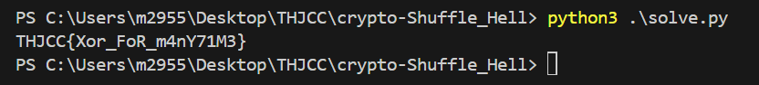

# crypto - Shuffle Hell - Writeup

---  

## FLAG：
`THJCC{Xor_FoR_m4nY71M3}`

## Observation：
- The  $FLAG$  is XORed with many random bytes and then output, which is performed 1337 times.
- After XORing the output line-by-line, we get the  $FLAG$  XORed itself 1337 times, and those random bytes XORed exactly twice, which results in the  $FLAG$ .

## Step：
1. XOR all the output.

## Exploit：  

```python
from Crypto.Util.number import *
with open("output.txt", "r") as f:
    lines = f.read().splitlines()
  
flag_bytearrays = [bytes.fromhex(line) for line in lines]
  
result = flag_bytearrays[0]
for array in flag_bytearrays[1:]:
    result = [a ^ b for a, b in zip(result, array)]
print("".join([chr(c) for c in result]))
```

